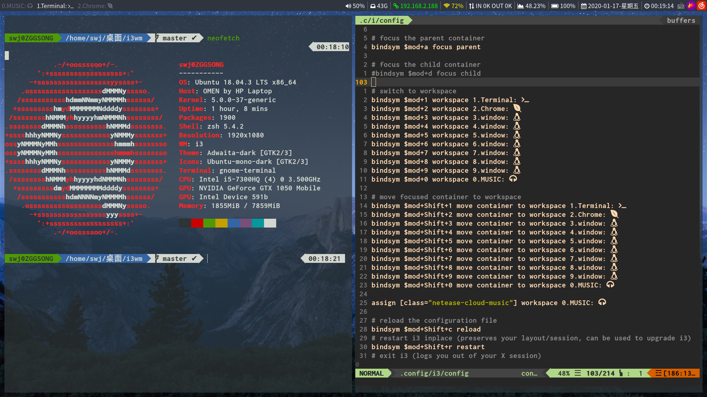

## 独享moment


##  解决问题

- 安装中文输入法

- 安装compton渲染器

- 安装variety

- 修改xmodmap 

- 增加音频控制

## 美化

- 修改壁纸

```
sudo apt install feh

feh --bg-scale 图片路径
```

- 字体

> powerline fonts: Inconsolata for Powerline BlodForPowerline 
```
# clone
git clone https://github.com/powerline/fonts.git --depth=1
# install
cd fonts
./install.sh
# clean-up a bit
cd ..
rm -rf fonts
```
- dmenu & rofi

	-	dmenu_run -nb black -sb gray -l 10
	- sudo apt install rofi
		- rofi -show run
- 窗口渲染器

```
sudo apt install compton
```
- 截图工具

```
sudo apt install flameshot

#使用
flameshot gui
```

- i3-gaps on debian(ubuntu)

> That's difficult!!!

```
#first
sudo apt install -y libxcb1-dev libxcb-keysyms1-dev libpango1.0-dev libxcb-util0-dev libxcb-icccm4-dev libyajl-dev libstartup-notification0-dev libxcb-randr0-dev libev-dev libxcb-cursor-dev libxcb-xinerama0-dev libxcb-xkb-dev libxkbcommon-dev libxkbcommon-x11-dev autoconf libxcb-xrm0 libxcb-xrm-dev automake libsnack2-dev libxcb-shape0-dev autoconf libev-dev build-essential git

#second
git clone https://www.github.com/Airblader/i3 i3-gaps
cd i3-gaps

#third
autoreconf --force --install
rm -rf build/
mkdir -p build && cd build/
../configure --prefix=/usr --sysconfdir=/etc --disable-sanitizers
make && sudo make install

#forth(in .config/i3/conf)
gaps inner 8
gaps outer 4
```


## ranger

> 配置与美化

```shell
#安装
sudo apt install ranger

#配置文件
ranger --copy-config=all

#高亮
sudo apt install highlight

#图片预览
sudo apt install w3m

#图片预览配置
vim ~/.config/ranger/rc.conf
设置set use_preview_script true
```

> 图标插件
```
##安装插件
git clone https://github.com/alexanderjeurissen/ranger_devicons ~/.config/ranger/plugins/ranger_devicons

cd~/.config/ranger/plugins/ranger_devicons

make install


##下载`nerd_font`字体
https://github.com/ryanoasis/nerd-fonts/raw/master/patched-fonts/InconsolataGo/Bold/complete/InconsolataGo%20Bold%20Nerd%20Font%20Complete%20Mono.ttf
mv InconsolataGo Bold Nerd Font Complete Mono.ttf ~/.local/share/fonts/

##修改'Terminal`字体即可
```


> [配置](https://www.crs811.com/archives/814)
